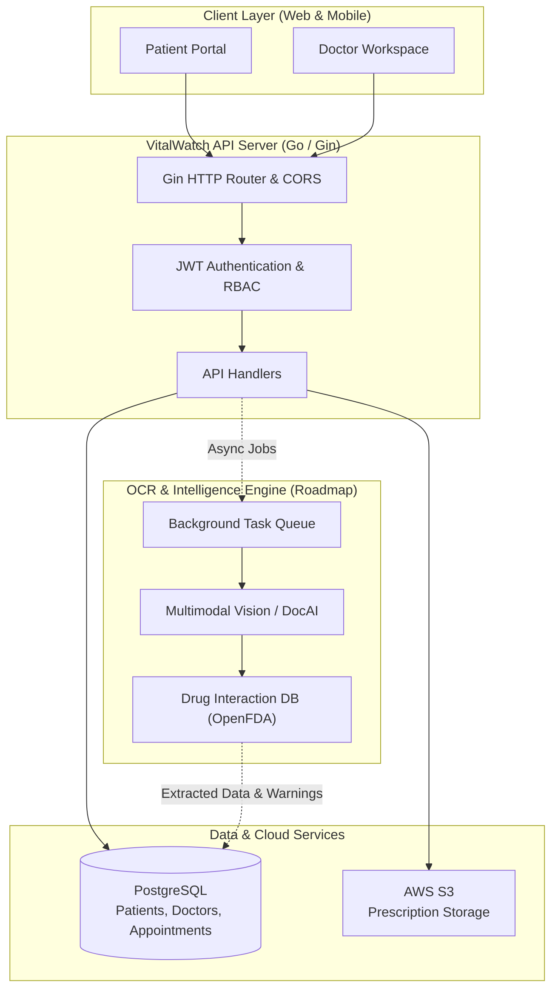

# 🩺 VitalWatch Backend

> **Intelligent Clinical Management & Prescription OCR Engine**

[](https://golang.org/)
[](https://gin-gonic.com/)
[](https://www.postgresql.org/)
[](https://aws.amazon.com/s3/)
[](./LICENSE)

VitalWatch is a clinical management backend built with Go, PostgreSQL, and AWS S3. It connects patients and doctors through appointments and prescription management. The platform is actively evolving toward an **Intelligent Health Platform** featuring automated prescription OCR analysis, drug interaction checking, and longitudinal vitals tracking.

---

## 🌟 Key Highlights & Vision

- 📅 **Doctor-Patient Appointment Engine**: Dynamic booking, status tracking, and doctor schedule management.
- 💊 **Prescription Archival & Processing**: Secure S3-backed clinical file uploads with role-scoped access control.
- 👁️ **Prescription OCR & Intelligence (In Progress)**: Asynchronous document analysis extracting medications, dosages, and schedules from handwritten clinical notes using Vision AI.
- ⚠️ **Safety & Interaction Alerts (Planned)**: Automated cross-referencing of extracted medications against patient allergy records and drug interaction databases.
- 📊 **Longitudinal Patient History**: Unified view of past visits, active prescriptions, and vitals over time.

---

## 🏗️ System Architecture



---

## ⚡ Current Features vs. Roadmap

| Capability | Current State | Target State |
| :--- | :--- | :--- |
| **Authentication** | JWT auth for Patients & Doctors | Unified Identity (UUIDs), Refresh Tokens, Admin Vetting for Doctors |
| **Appointments** | Basic booking & completion | Conflict-free slot engine, doctor working hours, telehealth links |
| **Prescriptions** | Upload PDF/Images to S3 | Pre-signed direct S3 uploads, async OCR extraction & parsing |
| **Prescription OCR** | Planned | Handwritten prescription OCR via Vision AI + Human-in-the-Loop review |
| **Drug Safety** | None | Real-time Drug-Drug Interaction (DDI) & patient allergy alerts |
| **Access Control** | Token authentication | Strict Role-Based Access Control (RBAC) & Protected Health Information (PHI) audit logging |

For granular task tracking, known bugs, and technical specifications, see [TODO.md](TODO.md) and the [Architecture & Roadmap Specification](docs/architecture-and-roadmap.md).

---

## 🛠️ Technology Stack

- **Language**: [Go](https://go.dev/) (1.24+)
- **HTTP Framework**: [Gin Web Framework](https://github.com/gin-gonic/gin)
- **Database**: [PostgreSQL](https://www.postgresql.org/) with [pgx/v5](https://github.com/jackc/pgx) driver
- **Migrations**: [golang-migrate](https://github.com/golang-migrate/migrate)
- **Object Storage**: [AWS S3](https://aws.amazon.com/s3/) via AWS SDK Go v2
- **Containerization**: [Docker](https://www.docker.com/) & Docker Compose

---

## 🚀 Getting Started

### Prerequisites

- [Go](https://golang.org/doc/install) 1.24 or higher
- [Docker](https://docs.docker.com/get-docker/) & Docker Compose
- AWS Account with an active S3 bucket (for prescription storage)

### 1. Clone the Repository

```bash
git clone https://github.com/RitwikGupta-0501/vital-watch-backend.git
cd vital-watch-backend
```

### 2. Configure Environment Variables

Copy the sample environment file:

```bash
cp .env.example .env
```

Update `.env` with your credentials:

```ini
# Application Secrets
JWT_SECRET=your_super_secret_jwt_key_here

# Database Configuration
DB_HOST=localhost
DB_PORT=5432
DB_USER=appuser
DB_PASSWORD=apppassword
DB_NAME=appdb
DB_SSLMODE=disable

# AWS S3 Configuration
AWS_REGION=us-east-1
S3_BUCKET_NAME=your-vital-watch-prescriptions-bucket
```

### 3. Run with Docker Compose

To start the database and backend application together:

```bash
docker compose up --build
```

The API will be available at `http://localhost:8000`.

### 4. Run Locally (Development)

1. Start only the PostgreSQL database:
   ```bash
   docker compose up db -d
   ```
2. Run the Go application:
   ```bash
   go run ./cmd/main/main.go
   ```

---

## 📡 API Endpoints Overview

### Public Routes
- `GET /api/ping` — Health check
- `POST /api/register` — Register a patient or doctor
- `POST /api/login` — Authenticate and obtain JWT token

### Protected Routes (`Authorization: Bearer <token>`)

#### Patient Endpoints
- `GET /api/profile` — Get authenticated profile
- `GET /api/doctors` — List available doctors
- `GET /api/patient/appointments` — List patient's appointments
- `POST /api/appointments` — Book a new appointment
- `GET /api/patient/prescriptions` — List patient's prescriptions
- `GET /api/prescriptions/:filename` — Download prescription file

#### Doctor Endpoints
- `GET /api/doctor/appointments` — List doctor's scheduled appointments
- `PATCH /api/appointments/:id` — Mark appointment as completed
- `GET /api/doctor/patients` — List all associated patients
- `GET /api/doctor/patients/:id/appointments` — View specific patient visit history
- `GET /api/doctor/patients/:id/prescriptions` — View specific patient prescription history
- `POST /api/prescriptions` — Upload and issue a new prescription
- `GET /api/doctor/prescriptions/:filename` — Download prescription file

---

## 📁 Repository Structure

```
.
├── cmd/
│   └── main/
│       └── main.go           # Application entrypoint & server setup
├── internal/
│   ├── api/
│   │   └── handlers.go       # HTTP handlers & middleware
│   ├── models/
│   │   └── models.go         # Domain data structures & interfaces
│   └── repository/
│       └── db.go             # Database queries & data access layer
├── migrations/               # SQL schema migrations (golang-migrate)
├── utils/                    # Password hashing & common helpers
├── docs/                     # Engineering specifications & roadmap
│   └── architecture-and-roadmap.md
├── Dockerfile                # Multi-stage container build
├── docker-compose.yml        # Multi-container orchestration
└── README.md
```

---

## 🔒 Security & Compliance Roadmap

VitalWatch handles sensitive health information. Prior to production readiness, the following compliance standards are being implemented:
- **HIPAA / PHI Compliance**: Full immutable audit logging of record access, encrypted at-rest S3 storage, and granular RBAC.
- **Direct S3 Pre-signed URLs**: Eliminating backend streaming to optimize bandwidth and enforce short-lived file access tokens.
- **Slot Conflict Prevention**: Database-level constraints to prevent double-booking.

---

## 📄 License

This project is licensed under the terms specified in the [LICENSE](LICENSE) file.
