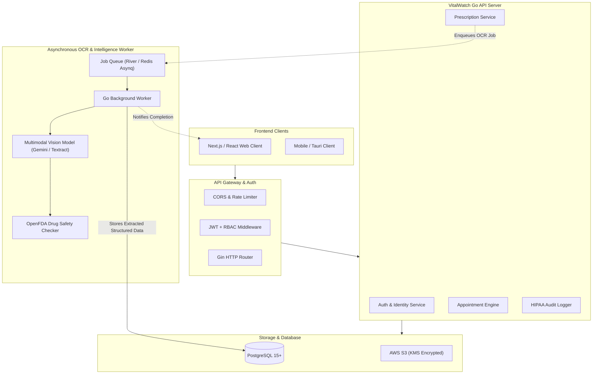
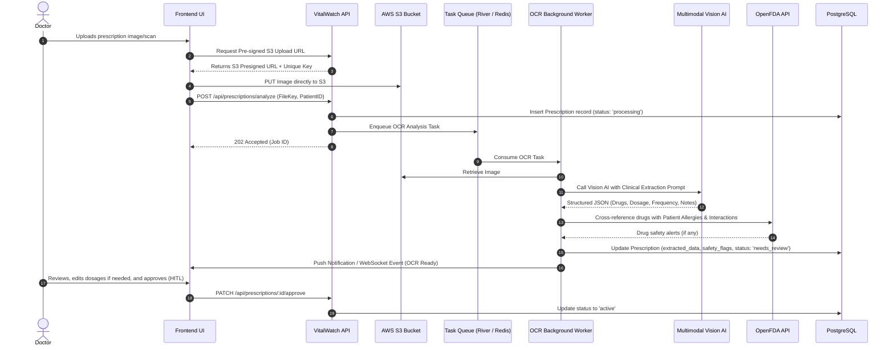

# 📋 VitalWatch: Architecture Blueprint & Enhancement Roadmap

> **Document Version**: 1.0.0  
> **Target Audience**: Backend Engineers, Platform Leads, Product Owners  
> **Status**: In Active Development

---

## 1. Executive Summary & Vision

VitalWatch is evolving from a baseline doctor-patient appointment system into an **Intelligent Clinical Workflow & Prescription Intelligence Engine**.

The core problem in modern outpatient care is that prescriptions and clinical notes remain trapped in unstructured, handwritten documents or disconnected PDF attachments. This causes:
- Medication non-adherence due to confusing schedules.
- Undetected Drug-Drug Interactions (DDIs) and patient allergy risks.
- Fragmented longitudinal history across multiple doctors.

VitalWatch solves this by combining **secure patient-doctor scheduling** with an **automated, asynchronous Multimodal Prescription OCR pipeline** and **clinical safety guardrails**.

---

## 2. Target Architectural Evolution



---

## 3. Core Architecture Enhancements

### 3.1. Unified Identity & Access Management (P0)

#### Current Problem
The existing database maintains two disconnected identity tables (`patients` and `doctors`) with colliding auto-incrementing integer IDs (`1, 2, 3...`). Handlers currently do not verify roles, allowing ID collision exploits (e.g., Patient #1 masquerading as Doctor #1).

#### Target Model
Migrate to a single canonical `users` table utilizing UUIDs, with specialized profile satellite tables:

```sql
-- Core User Identity
CREATE TABLE users (
    id UUID PRIMARY KEY DEFAULT gen_random_uuid(),
    email VARCHAR(255) UNIQUE NOT NULL,
    hashed_password VARCHAR(255) NOT NULL,
    role VARCHAR(50) NOT NULL CHECK (role IN ('patient', 'doctor', 'admin', 'clinic_staff')),
    is_active BOOLEAN DEFAULT TRUE,
    created_at TIMESTAMPTZ DEFAULT now(),
    updated_at TIMESTAMPTZ DEFAULT now()
);

-- Doctor Profile
CREATE TABLE doctor_profiles (
    user_id UUID PRIMARY KEY REFERENCES users(id) ON DELETE CASCADE,
    first_name VARCHAR(100) NOT NULL,
    last_name VARCHAR(100) NOT NULL,
    license_number VARCHAR(100) UNIQUE,
    specialty VARCHAR(100) DEFAULT 'General Practitioner',
    experience_years INT DEFAULT 0,
    is_verified BOOLEAN DEFAULT FALSE,
    consultation_fee DECIMAL(10, 2) DEFAULT 0.00
);

-- Patient Profile
CREATE TABLE patient_profiles (
    user_id UUID PRIMARY KEY REFERENCES users(id) ON DELETE CASCADE,
    first_name VARCHAR(100) NOT NULL,
    last_name VARCHAR(100) NOT NULL,
    date_of_birth DATE,
    gender VARCHAR(20),
    phone_number VARCHAR(20),
    allergies TEXT[] DEFAULT ARRAY[]::TEXT[],
    emergency_contact JSONB
);
```

---

### 3.2. Prescription OCR & Intelligence Engine (P1)

Prescription analysis cannot be performed synchronously inside an HTTP request due to vision model latency (2–8 seconds) and handwriting complexity.

#### Step-by-Step Processing Flow:



#### Structured Vision Extraction Schema:
```json
{
  "medications": [
    {
      "name": "Amoxicillin",
      "dosage": "500mg",
      "route": "oral",
      "frequency": "Three times daily",
      "timing": "After meals",
      "duration_days": 7,
      "refills": 0,
      "special_instructions": "Complete full course"
    }
  ],
  "diagnosis_notes": "Acute bacterial sinusitis",
  "ocr_confidence_score": 0.94,
  "flagged_unclear_words": []
}
```

#### Human-in-the-Loop (HITL) Requirement
No AI model is 100% accurate on cursive clinical scripts. The extracted medications must be marked with status `needs_review` and presented in the UI with a split-screen viewer (original scan alongside editable fields) before becoming legally active records.

---

### 3.3. Conflict-Free Appointment Engine (P1)

#### Prevention of Double-Booking
To prevent race conditions during simultaneous booking attempts, PostgreSQL GIST exclusion constraints are enforced at the database layer:

```sql
CREATE EXTENSION IF NOT EXISTS btree_gist;

CREATE TABLE appointments (
    id UUID PRIMARY KEY DEFAULT gen_random_uuid(),
    doctor_id UUID NOT NULL REFERENCES users(id),
    patient_id UUID NOT NULL REFERENCES users(id),
    start_time TIMESTAMPTZ NOT NULL,
    end_time TIMESTAMPTZ NOT NULL,
    status VARCHAR(50) DEFAULT 'scheduled' CHECK (status IN ('scheduled', 'in_progress', 'completed', 'cancelled')),
    appointment_type VARCHAR(50) DEFAULT 'in_person' CHECK (appointment_type IN ('in_person', 'virtual')),
    meeting_url TEXT,
    notes TEXT,
    created_at TIMESTAMPTZ DEFAULT now(),
    
    -- Guarantee end_time is strictly after start_time
    CONSTRAINT valid_timespan CHECK (end_time > start_time),
    
    -- Guarantee no overlapping appointments for the same doctor
    EXCLUDE USING gist (
        doctor_id WITH =,
        tstzrange(start_time, end_time) WITH &&
    ) WHERE (status != 'cancelled')
);
```

---

### 3.4. Security, Compliance & Audit Logging (P0)

Healthcare compliance (HIPAA, GDPR Health Data) mandates strict data handling:

1. **Direct S3 Pre-Signed URLs**:
   - Files are never proxied or streamed through the Go server memory.
   - S3 URLs have a strictly enforced 5-minute Time-to-Live (TTL).
2. **KMS Encryption**:
   - S3 buckets enforce server-side encryption via AWS KMS (`aws:kms`).
3. **Immutable Audit Trail**:
   - Every read and write access to patient records, prescriptions, and appointment histories is logged:
   ```sql
   CREATE TABLE ph_audit_logs (
       id BIGSERIAL PRIMARY KEY,
       actor_id UUID NOT NULL REFERENCES users(id),
       target_patient_id UUID NOT NULL REFERENCES users(id),
       action VARCHAR(100) NOT NULL, -- e.g., 'READ_PRESCRIPTION', 'VIEW_HISTORY'
       resource_id VARCHAR(255) NOT NULL,
       ip_address VARCHAR(45) NOT NULL,
       user_agent TEXT,
       timestamp TIMESTAMPTZ DEFAULT now()
   );
   ```

---

## 4. Prioritized Implementation Roadmap

### Phase 1: Security, Identity & Foundation (Weeks 1–2)
- [ ] **Fix Package-Level JWT Secret Initialization Bug**
- [ ] **Design & Run Unified Identity Migration (`users`, `doctor_profiles`, `patient_profiles`)**
- [ ] **Implement Strict Role-Based Middleware (`RequireRole("doctor")`, `RequireRole("patient")`)**
- [ ] **Fix BOLA on Appointment Completion & Prescription Access**
- [ ] **Replace S3 Streaming with S3 Pre-signed Upload & Download URLs**
- [ ] **Remove `tmpfs` from `docker-compose.yml` to prevent container data wipe**
- [ ] **Tune PostgreSQL Connection Pool (`SetMaxOpenConns`, `SetMaxIdleConns`)**
- [ ] **Implement Graceful HTTP Server Shutdown (`http.Server.Shutdown`)**

### Phase 2: Core Clinical Scheduling (Weeks 3–4)
- [ ] **Implement Database Exclusion Constraints for Overlapping Appointments**
- [ ] **Doctor Working Hours & Availability Schedule Configuration**
- [ ] **Dynamic Available Slot Generation Engine**
- [ ] **Telehealth Video Link Generator for Virtual Appointments**
- [ ] **Cursor-based Pagination for Patient Histories and Appointment Lists**
- [ ] **Database Indexes on all Foreign Keys & Search Fields**

### Phase 3: Prescription OCR & Intelligence Engine (Weeks 5–6)
- [ ] **Deploy Background Task Queue ([River](https://github.com/riverqueue/river) in Postgres or Redis [Asynq](https://github.com/hibiken/asynq))**
- [ ] **Build Vision AI Client integration with structured JSON clinical schema**
- [ ] **Implement Human-in-the-Loop (HITL) Verification Workflow**
- [ ] **Integrate OpenFDA API for Drug-Drug Interaction (DDI) alerts**
- [ ] **Patient Allergy Cross-referencing against prescribed drugs**
- [ ] **WebSocket or SSE notification for OCR task completion**

### Phase 4: Patient Experience, Vitals & Compliance (Weeks 7–8)
- [ ] **Longitudinal Patient Vitals Tracking (Blood Pressure, Heart Rate, Glucose)**
- [ ] **Automated Medication Schedules & Reminder Notifications**
- [ ] **HIPAA PHI Access Audit Logging Middleware**
- [ ] **Automated Test Suite (Unit Tests, Repository Mocks, API Integration Tests)**
- [ ] **GitHub Actions CI/CD Pipeline (`golangci-lint`, `govulncheck`, `go test -race`)**

---

## 5. Decision Log (ADRs)

| ADR ID | Decision | Rationale | Alternatives Considered |
| :--- | :--- | :--- | :--- |
| **ADR-001** | Unified `users` table with UUIDs | Prevents ID collision between doctors and patients, enforces clean foreign keys, and prevents BOLA. | Distinct ID spaces with role prefixing (`doc_1`, `pat_1`). |
| **ADR-002** | S3 Pre-Signed URLs for all uploads/downloads | Eliminates Go backend bandwidth bottlenecks, decreases memory footprint, and leverages cloud CDN/edge encryption. | Server-side `io.Copy` file streaming. |
| **ADR-003** | Asynchronous Task Queue for OCR | Vision model latency (2–8s) violates HTTP request SLA; async queues guarantee retries and decoupled scaling. | Synchronous HTTP multipart processing. |
| **ADR-004** | Human-in-the-Loop (HITL) verification for OCR | Medical prescriptions require 100% clinical accountability; unverified AI commits are dangerous and violate medical standards. | Fully automated prescription creation without doctor confirmation. |
